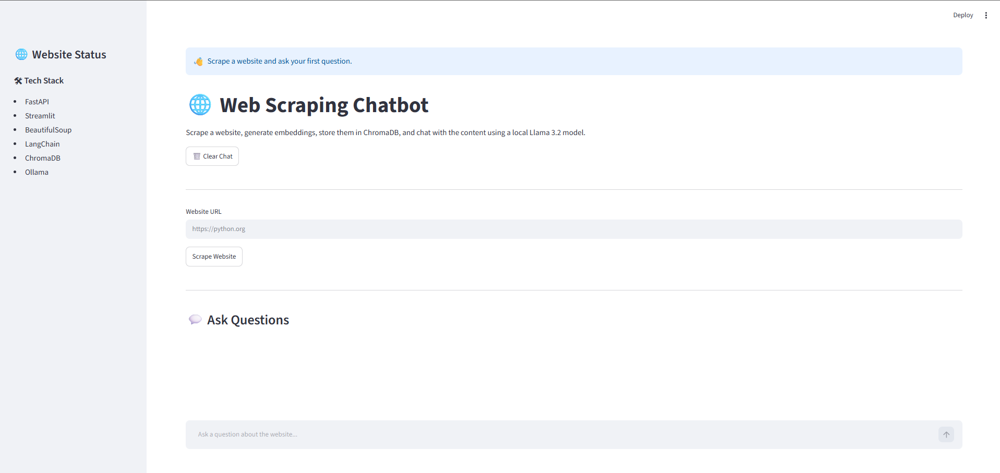
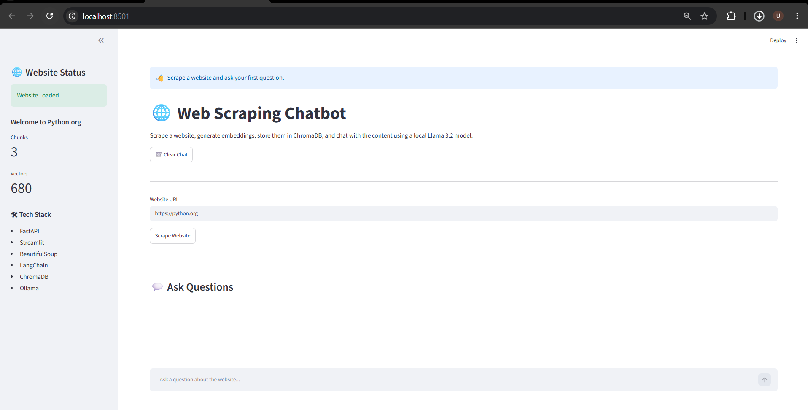
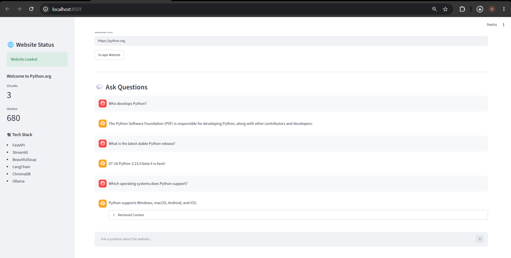
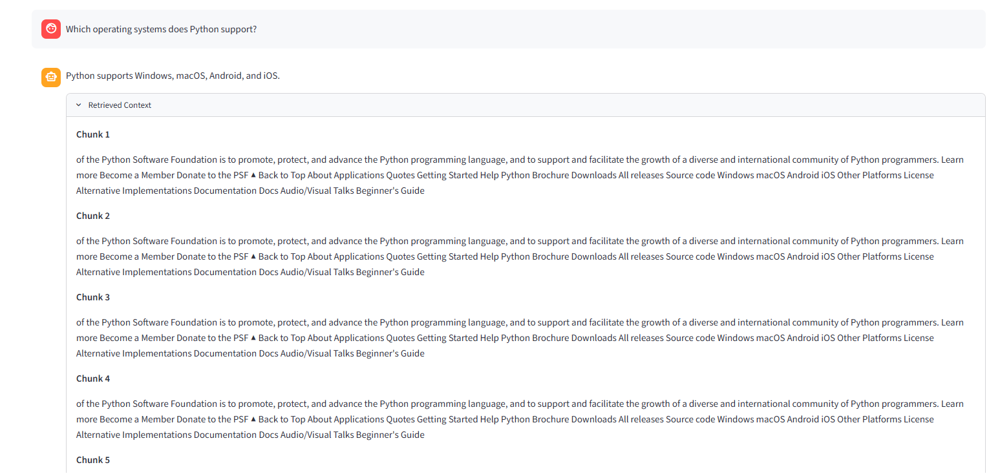

# 🌐 Web Scraping Chatbot

An AI-powered chatbot that scrapes website content, stores it in a vector database, and answers user questions using Retrieval-Augmented Generation (RAG) with a locally hosted LLM.

---

## 🚀 Features

- Scrape content from any public website
- Extract and clean webpage text
- Split content into semantic chunks
- Generate embeddings using Ollama
- Store embeddings in ChromaDB
- Perform semantic similarity search
- Answer questions using Llama 3.2
- Interactive Streamlit chat interface
- FastAPI backend
- View retrieved context used for each answer

---

## 🛠️ Tech Stack

| Category | Technology |
|----------|------------|
| Backend | FastAPI |
| Frontend | Streamlit |
| Web Scraping | BeautifulSoup, Requests |
| LLM | Ollama (Llama 3.2) |
| Embeddings | nomic-embed-text |
| Vector Database | ChromaDB |
| AI Framework | LangChain |
| Language | Python |

---

## 🏗️ Architecture

```text
Website URL
      │
      ▼
Web Scraper
      │
      ▼
Extract Text
      │
      ▼
Text Chunking
      │
      ▼
Generate Embeddings
      │
      ▼
ChromaDB Vector Store
      │
      ▼
User Question
      │
      ▼
Similarity Search
      │
      ▼
Llama 3.2 (Ollama)
      │
      ▼
AI Response
```

---

## 📂 Project Structure

```text
web-scraping-chatbot/
│
├── app/
│   ├── ai/
│   │   ├── chatbot.py
│   │   └── embeddings.py
│   │
│   ├── api/
│   │   └── routes.py
│   │
│   ├── models/
│   │   └── schemas.py
│   │
│   ├── services/
│   │   ├── scraper.py
│   │   ├── text_splitter.py
│   │   └── vector_store.py
│   │
│   └── utils/
│
├── frontend/
│   └── streamlit_app.py
│
├── chroma_db/
├── requirements.txt
├── main.py
├── README.md
└── .gitignore
```

---

## ⚙️ Installation

Clone the repository:

```bash
https://github.com/MohamedUmerZunzunia/web-scraping-chatbot
cd web-scraping-chatbot
```

Create a virtual environment:

```bash
python -m venv venv
```

Activate it:

### Windows

```bash
venv\Scripts\activate
```

### Linux / macOS

```bash
source venv/bin/activate
```

Install dependencies:

```bash
pip install -r requirements.txt
```

---

## 🤖 Install Ollama

Download and install Ollama.

Pull the required models:

```bash
ollama pull llama3.2
ollama pull nomic-embed-text
```

Start Ollama before running the application.

---

## ▶️ Running the Project

Start the FastAPI backend:

```bash
uvicorn main:app --reload
```

In another terminal, start Streamlit:

```bash
streamlit run frontend/streamlit_app.py
```

Open your browser at:

```
http://localhost:8501
```

---

## 📖 How to Use

1. Enter a website URL.
2. Click **Scrape Website**.
3. Wait for the content to be processed.
4. Ask questions about the website.
5. View the retrieved context used to generate each response.

---

## 📸 Screenshots

### Home Page


### Website Loaded



### Chat Interface



### Retrieved Context



---

## 📌 API Endpoints

### Scrape Website

```
POST /scrape
```

Example request:

```json
{
    "url": "https://python.org"
}
```

---

### Chat

```
POST /chat
```

Example request:

```json
{
    "question": "What is Python?"
}
```

---

## 🔮 Future Improvements

- Hybrid search (keyword + vector search)
- Metadata filtering
- Cross-encoder reranking
- Multi-website support
- Website caching
- Conversation memory
- Docker deployment
- Cloud deployment

---

## 📄 License

This project is licensed under the MIT License.

---

## 👨‍💻 Author

**Your Name**

GitHub: https://github.com/YOUR_USERNAME